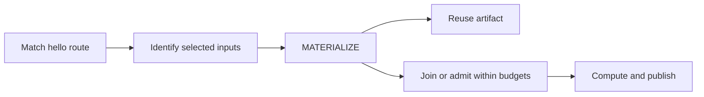

# Configuration

One YAML file defines the gateway, its persistent state, and the policies for
incoming requests. Start with one route, decide which inputs identify its work,
then set the computation and storage budgets.

## Configuration model

The file has five required top-level fields:

| Field | Purpose |
|---|---|
| `schema` | Configuration format version; currently `1`. |
| `gateway` | Listeners, upstream origin, global resource limits and work ownership. |
| `store` | Directory and capacity for reusable artifacts. |
| `routes` | Rules for classifying requests, identifying operations and choosing a strategy. |
| `fallback` | The denial policy for unmatched requests. |

## Start with one route

This is the complete [example configuration](examples/materialize.yaml) used by
the [packaged quick start](README.md#quick-start). It serves `/hello/{name}` from a
loopback origin and persists the result. Both listeners bind to loopback.

```yaml
schema: 1
gateway:
  listen.host: 127.0.0.1
  listen.port: 8080
  admin.host: 127.0.0.1
  admin.port: 8081
  origin.host: 127.0.0.1
  origin.port: 9000
  origin.completion-contract: RESPONSE_COMPLETE
  origin.ownership-directory: ./bounded-origin-data/ownership
  temporary.directory: ./bounded-origin-data/spool
  http.max-request-body-bytes: 0
  origin.max-active: 2
  origin.max-queued: 4
  origin.max-execution-duration: PT5S
  origin.response-timeout: PT5S
  origin.max-result-bytes: 65536
  request.timeout: PT10S
store:
  directory: ./bounded-origin-data/artifacts
  max-bytes: 67108864
  max-artifact-bytes: 65536
routes:
  - id: hello
    version: 1
    precedence: 10
    match:
      method: GET
      path: /hello/{name}
      trust: UNTRUSTED
    strategy: MATERIALIZE
    representation: PUBLIC_IMMUTABLE
    key:
      path: [name]
      query:
        include: []
    materializer-version: hello-v1
    budget:
      max-active: 2
      max-queued: 4
      max-execution-duration: PT5S
      max-result-bytes: 65536
fallback:
  id: default-deny
  version: 1
  precedence: -2147483648
  strategy: DENY
```

With the packaged `bin` directory on your PATH, check and run it:

```sh
bounded-origin validate --config materialize.yaml
bounded-origin run --config materialize.yaml
```

On Windows, use `bounded-origin.bat`. Paths are relative to the process working
directory, not the YAML file. Configuration changes take effect on restart.
`validate` checks the document and policy rules without acquiring directories or
listeners. It does not contact the origin.

### Follow a request



For this route, `name` is a semantic input. `query.include: []` drops query input,
so `/hello/world?noise=one` and `/hello/%77orld?noise=two` identify the same work.
The producer receives the normalized, selected inputs.

`MATERIALIZE` checks the store first. On a miss, callers join an existing flight
or start work within both budgets. This example allows two active operations and
four queued operations. Excess demand receives 503 with `Retry-After`; an unmatched
path receives 403. Stored results survive restart.

### Adapt the example

| Decide | Settings to change |
|---|---|
| Where traffic arrives and work runs | `listen.*`, `admin.*`, `origin.host`, `origin.port`. Keep admin access private. |
| Which requests name the same work | Route `match` and `key`. Select every input the origin needs to distinguish results. |
| Whether results can be reused | `strategy`, `representation`, policy `version` and `materializer-version`. |
| How much work may be outstanding | Global `origin.max-active` / `origin.max-queued` and each route's `budget`. |
| How long callers and producers wait | `request.timeout`, `origin.response-timeout` and global/policy execution durations. |
| Where state lives and how large it may grow | Store, ownership and spool directories; body, result and storage limits. |

The limits bound outstanding operations and queues. They do not impose a fixed
operations-per-second rate or CPU percentage. Read the contracts below before
connecting an application origin.

## Before production

Two declarations connect configuration to application behavior: the origin must
truthfully report completion, and its responses must be safe to share. Validation
checks the declarations, but cannot establish either property for an application
or verify the deployed filesystem's behavior.

### Computation ownership

Computation routes require `RESPONSE_COMPLETE` and an ownership directory. The
origin must guarantee that **all expensive work caused by the operation, including
delegated work, ends before its complete, self-delimited response**. Origins that
leave detached jobs running after the response cannot use this contract.

Before dispatch, the gateway durably reserves capacity. A trustworthy complete
response plus successful durable release ends that ownership. Local timeouts,
disconnects, thread interruption and transport failure are not completion proof.
Uncertain work keeps capacity indefinitely, through process death and restart.
Requests cannot bypass it with a different key or a per-key cooldown expiry.

Same-key retries are rejected while durable work remains unresolved after its
local flight ends. The live shared flight can still accept followers while it is
running; each caller has its own request lifetime.

Use an initially quiescent admission domain, preserve its files and exclude other
owners. All computation being bounded must pass through that domain. Independent
domains do not share a global budget.

Startup can fail if persisted state is invalid, another owner holds the directory,
or new limits conflict with outstanding work. There is no automatic cancellation,
reconciliation or reset command. Establish termination of all old work and owners
independently before replacing ownership state. A timer or successful gateway
restart is insufficient.

The execution deadline bounds local execution/waiting, not arbitrary remote CPU
lifetime. A caller timeout or disconnect alone does not cancel the shared producer;
late successful materialization may publish while that producer is still running.
If the producer itself terminates with uncertain remote work, no late artifact is
promised. Graceful shutdown is bounded and retains unresolved durable ownership.

### Public representation contract

`PUBLIC` means output is safe to share among callers of the same identified
operation. It may change between successive flights. `PUBLIC_IMMUTABLE` additionally
asserts that output remains valid for that versioned identity and is safe to store
and reuse. Neither assertion is established by stripping authentication headers.

The origin must affirm sharing with `Cache-Control: public`. The gateway publishes
explicit public artifacts; it is not a transparent proxy for arbitrary application
responses. Check the [shared response requirements](#shared-response-requirements)
for accepted headers and error handling.

## Field reference

Look up [gateway settings](#gateway), [store settings](#store),
[routes and strategies](#routes-and-fallback), [semantic inputs](#semantic-input-projection),
or [document limits](#document-and-limits). This reference describes the CLI YAML
mapping. Embedded Java builders are a separate interface.

The authoritative decoders and cross-field checks are in
[the CLI sources](bounded-origin-cli/src/main/java/io/github/aalsanie/boundedorigin/cli),
with gateway defaults in
[GatewayConfig.from](bounded-origin-proxy/src/main/java/io/github/aalsanie/boundedorigin/proxy/GatewayConfig.java).

## Gateway

These are literal keys within the `gateway` mapping; dots do not introduce nested
YAML. Unless marked required, omission selects the listed default. `P` is the
JVM's reported available processor count.

### Computation and admission

| Key | Default | Meaning / constraint |
|---|---|---|
| `origin.completion-contract` | `DISABLED` | `DISABLED` or `RESPONSE_COMPLETE`; see [computation ownership](#computation-ownership). |
| `origin.ownership-directory` | absent | Required for `RESPONSE_COMPLETE`; persistent exclusive computation ownership. |
| `origin.max-active` | `8` | Positive global producer capacity. |
| `origin.max-queued` | `64` | Nonnegative global waiting-operation limit. |
| `origin.max-execution-duration` | `PT20S` | Local producer execution deadline. |
| `origin.max-result-bytes` | `16777216` | Positive producer result limit. |
| `origin.failure-cooldown` | `PT2S` | Per-key suppression after failure, separate from unresolved ownership. |
| `origin.max-cooldown-entries` | `4096` | Positive bounded cooldown registry size. |

### Listeners and trust

| Key | Default | Meaning / constraint |
|---|---|---|
| `listen.host` | `0.0.0.0` | Public listener address. |
| `listen.port` | `8080` | 0–65,535; 0 requests an ephemeral port. |
| `admin.host` | `127.0.0.1` | Separate operator listener. |
| `admin.port` | `8081` | 0–65,535. |
| `ingress.trust` | `UNTRUSTED` | `UNTRUSTED` or `TRUSTED`, assigned by deployment configuration. |
| `forwarded.trust` | `false` | Whether forwarded metadata is trusted. Does not authenticate callers or elevate request trust. |
| `event-loop.threads` | `max(2, min(16, P))` | Positive frontend event-loop count. |
| `frontend.max-connections` | `4096` | Positive accepted connection limit. |
| `server.backlog` | `1024` | Positive listener backlog setting. |

### Origin connections

| Key | Default | Meaning / constraint |
|---|---|---|
| `origin.host` | **required** | One upstream host. |
| `origin.port` | **required** | 1–65,535. |
| `origin.event-loop.threads` | `max(2, min(8, P))` | Positive upstream event-loop count. |
| `origin.max-connections` | `origin.max-active` | Positive upstream connection-pool capacity, separate from computation ownership. |
| `origin.max-pending-acquires` | `origin.max-queued` | Nonnegative pool acquisition queue limit. |
| `origin.acquire-timeout` | `PT2S` | Maximum pool acquisition wait. |
| `origin.connect-timeout` | `PT3S` | Upstream connection deadline. |
| `origin.response-timeout` | `PT20S` | Local wait for an upstream response. |

### Bodies and buffering

| Key | Default | Meaning / constraint |
|---|---|---|
| `temporary.directory` | **required** | Exclusive body spool directory. |
| `http.max-initial-line-bytes` | `8192` | Positive request-line limit. |
| `http.max-header-bytes` | `16384` | Positive header limit. |
| `http.chunk-bytes` | `16384` | Positive decoder chunk size. |
| `http.max-request-body-bytes` | `8388608` | Nonnegative body limit; 0 disallows nonempty bodies. |
| `http.chunked-response-threshold-bytes` | `65536` | Nonnegative downstream streaming threshold. |
| `spool.max-bytes` | `536870912` | Positive total spool reservation limit. |
| `spool.max-files` | `4096` | Positive spool file limit. |
| `downstream.write-low-watermark-bytes` | `32768` | Positive write-buffer low watermark. |
| `downstream.write-high-watermark-bytes` | `65536` | Positive high watermark, strictly above low. |

### Request deadlines and overload

| Key | Default | Meaning / constraint |
|---|---|---|
| `request.timeout` | `PT30S` | Downstream request deadline. |
| `idle.timeout` | `PT30S` | Connection idle deadline. |
| `drain.timeout` | `PT30S` | Bounded graceful drain period. |
| `overload.retry-after-seconds` | `1` | Positive integer `Retry-After` value on overload. |

### Cross-field constraints

- Public and admin listener addresses must differ unless their port is 0.
- `spool.max-bytes` must fit the larger of the request body limit and global result
  limit. It need not fit every active result simultaneously; exhaustion rejects work.
- Both `origin.response-timeout` and `origin.max-execution-duration` must be at most
  `request.timeout`.
- Each policy budget must be at most the corresponding global budget. Limits
  constrain simultaneous work; they do not reserve capacity for each policy or
  guarantee a latency/fairness target.
- `MATERIALIZE` policy result limits must fit `store.max-artifact-bytes`.
- Store and ownership directories must not overlap. Use separate private, stable
  store, ownership and spool directories with reliable filesystem locking and atomic
  moves. Do not share one runtime domain across independent defining classloaders.

## Store

All fields are required, including for a configuration containing only deny routes.

| Key | Constraint / meaning |
|---|---|
| `directory` | Nonblank path, exclusively owned by the runtime. |
| `max-bytes` | Positive total committed-artifact capacity, including metadata. |
| `max-artifact-bytes` | Nonnegative body size, at most `max-bytes`. |

Store publication is atomic and reads verify integrity. A corrupt lookup fails;
cleanup/recovery can leave a later miss. Eligible policies may recompute. Active
result owners pin artifacts against eviction. Pins, staging and failed deletions
can consume resources after caller completion; temporary/staging space is
additional to committed store capacity. Do not edit, roll back or externally clean
live directories. Filesystem corruption detection is not a hostile-filesystem or
power-loss recovery guarantee.

## Routes and fallback

Each route requires:

| Field | Contract |
|---|---|
| `id` | Nonblank string, unique across routes and fallback. |
| `version` | Nonnegative integer identifying the policy version. |
| `precedence` | Signed 32-bit integer; higher wins. |
| `match` | Mapping described below. |
| `strategy` | One of the five strategies below. |

`fallback` requires `id`, `version`, `precedence` and `strategy: DENY`, with no
`match`. Its precedence must be strictly below every route. Configuration rejects
potentially overlapping routes with equal precedence. Ordering routes in the YAML
does not select a winner. No matching route means denial.

`match.path` is required. Optional `method`, `host` and `trust` narrow the match;
omission leaves that dimension unconstrained. Methods are HTTP tokens normalized
to uppercase; host comparison normalizes case. Trust is `UNTRUSTED` or `TRUSTED`.
Request headers cannot grant trust.

Paths support fixed segments, whole-segment captures such as `/render/{name}`, and
a terminal `/**` matching zero or more remaining segments. `/` is valid. Empty
segments, trailing slashes other than `/`, unsupported wildcards, traversal,
encoded separators, backslash and NUL are rejected. Fixed template literals match
their configured form; do not assume arbitrary URL aliases collapse. Supported
percent normalization of captures and selected query values is described below.

### Strategy fields

All keyed strategies require `key` and a nonblank `materializer-version` string.
Policy ID/version and materializer version namespace the resulting operation key.
Change versions when the meaning or immutable output changes; no TTL or HTTP
revalidation updates old artifacts automatically.

| Strategy | Additional required fields | Forbidden fields / behavior |
|---|---|---|
| `DENY` | None | No `key`, `materializer-version`, `representation`, `budget` or `client-computation`. |
| `ARTIFACT_ONLY` | `representation: PUBLIC_IMMUTABLE` | No `budget` or `client-computation`. An artifact miss returns 404. |
| `BOUNDED_COMPUTE` | `representation`, `budget` | `PUBLIC` or `PUBLIC_IMMUTABLE`; no `client-computation`. New results are not persisted. Only immutable operations may reuse existing artifacts. |
| `MATERIALIZE` | `representation: PUBLIC_IMMUTABLE`, `budget` | No `client-computation`. Computes on a miss and publishes eligible output. |
| `CLIENT_COMPUTE` | `client-computation` | No `representation`, `budget` or selected headers. Returns a description; does not execute origin work or implement the client algorithm. |

Every `budget` field is required: positive `max-active`, nonnegative `max-queued`,
positive ISO-8601 `max-execution-duration`, and positive `max-result-bytes`. Global
and policy bounds both apply. Queues contain operations; same-operation followers
join the existing execution instead of adding producers. Admission exhaustion
returns 503 with `Retry-After`.

`client-computation` requires nonblank string `type` and `version`. Optional
`parameters` defaults to an empty mapping of nonblank string names and values.
The application consuming the JSON description defines their meaning.

### Semantic input projection

Within `key`:

| Field | Default / behavior |
|---|---|
| `path` | Empty list; must explicitly list every named path capture. Unknown or duplicate names fail. |
| `query` | **If omitted, the raw query remains an input.** Set this mapping to select query parameters. |
| `query.include` | Empty list when `query` is present; only these normalized names are retained. An empty list drops query input. |
| `query.order-independent` | `false`; `true` sorts selected pairs without removing duplicates. |
| `headers` | Empty list; eligible lowercase header names whose exact ordered values affect representation. |

The HTTP identity includes method, host authority, projected target, request-body
SHA-256, trust, representation and selected headers, even when a route constrains
some dimensions. Named captures are normalized into the projected target; a
catch-all retains the complete path and therefore its cardinality. Host authority
is separate from the configured connection address. Constrain `match.host` when
only one authority is meaningful.

Capture/selected-query normalization decodes percent-encoded unreserved characters
and normalizes the case of retained percent escapes. It does not convert `+` to a
space. Missing parameters, bare `x` and `x=` remain distinct. Duplicate values retain
multiplicity; order remains significant unless `order-independent: true` is set.
This is explicit configured equivalence, not a claim that all URL spellings mean
the same application operation.

Only the projected target, selected headers, computed framing and operation Host
reach the producer, with the received body verified against its digest. Ordinary
unselected headers are not forwarded. Selected absence differs from a present
empty value. If a request contains `Content-Type` or `Content-Encoding`, select it
explicitly to identify its body interpretation.

Selection forbids authorization/cookie, Host, framing/hop-by-hop, forwarded, range,
cache-control, pragma, `if-*` and `x-bounded-origin-*` headers. The exact set is
enforced by [HttpOperation](bounded-origin-proxy/src/main/java/io/github/aalsanie/boundedorigin/proxy/HttpOperation.java).
Requests requiring authorization, cookies, range, conditional or freshness
semantics are rejected before shared lookup or computation; selecting a forbidden
header cannot opt out of this boundary.

### Shared response requirements

The response must affirm `Cache-Control: public`. Only the additional directive
`no-transform` is accepted. Freshness directives such as `max-age`, `immutable`,
`no-cache` and unknown directives are not supported.

`Expires`, `Age`, `Pragma`, cookies, authentication responses, partial/conditional
responses and trailers are not eligible. `Vary` may name only Host or explicitly
selected headers. Validation also applies to stored metadata.

Public immutable errors, including eligible HTTP 500 responses, can be shared and
materialized; classify such output deliberately.

## Document and limits

All five root fields are required: `schema: 1`, `gateway`, `store`, `routes` and
`fallback`. `routes` may be empty. Unknown fields, duplicate fields, nulls and wrong
types fail validation. Use one UTF-8 YAML document without anchors, aliases,
explicit tags or directives. Limits apply together; reaching one can prevent
reaching another.

| Limit | Maximum |
|---|---:|
| File bytes / document code points | 131,072 each |
| Structural depth | 24 |
| Scalar code points | 8,192 |
| Child nodes in one collection | 4,096; mapping keys and values both count |
| Total nodes | 16,384 |
| Routes | 1,024 |
| Segments in a route template | 128 |
| Entries in each key dimension list | 128 |
| Client computation parameters | 256 |

Route/store integers must be YAML integers. Gateway values are scalar strings,
integers or booleans subsequently parsed for the named setting. Durations are
positive ISO-8601 strings such as `PT5S`, with overflow rejected, including conversion
to nanoseconds. Byte quantities are decimal counts, without unit suffixes. Integer
counts use signed 32-bit range; byte quantities and versions use signed 64-bit
range unless the field reference specifies a narrower constraint. Enum values are
case-sensitive.

## CLI behavior

The packaged CLI accepts `validate --config PATH` or `run --config PATH`.
Configuration is immutable until restart.

| Exit code | Meaning |
|---|---|
| `0` | Success; validation is silent. |
| `2` | Configuration or input failure. |
| `3` | Runtime failure. |
| `64` | Incorrect command usage. |

## Observability

The separate admin listener exposes `/health`, `/ready` and Prometheus text at
`/metrics`. It defaults to loopback. Keep it on an operator-controlled network;
readiness describes gateway lifecycle, not origin health or spare compute capacity.

| Metric family | Meaning |
|---|---|
| `bounded_origin_requests_total` | Decoded requests observed by the gateway. |
| `bounded_origin_single_flight_joins_total`, `bounded_origin_artifact_hits_total` | Joined executions and validated artifact lookups; neither promises completed client delivery. |
| `bounded_origin_origin_active`, `bounded_origin_origin_queue_depth`, `bounded_origin_origin_in_flight` | Local executor state. |
| `bounded_origin_origin_work_outstanding`, `bounded_origin_origin_work_unresolved` | Durable ownership and the subset whose termination is unknown. These are not remote CPU meters. |
| `bounded_origin_origin_executions_total` | Dispatch authorizations after durable reservation; actual remote execution must be measured at the origin. |
| `bounded_origin_rejections_total`, `bounded_origin_origin_pool_rejections_total` | Aggregate gateway rejection indications and separate pool pressure. |

Metrics also cover bytes, store/spool usage and duration sums/counts. Structured
request logs include status and duration. Aggregate rejection counters mix causes;
there are no built-in latency percentiles or exact producer failure-rate counters.
Use origin instrumentation and client measurements when validating computation or
tail latency. The benchmark harness does this independently.
