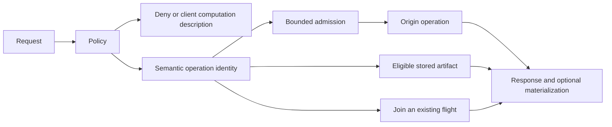

# Bounded Origin

**Untrusted demand must not control the rate of expensive origin computation.**

Bounded Origin is a Java library and a configuration-driven HTTP gateway for
controlling which semantic operations may reach an expensive origin. It combines
policy selection, single-flight execution, explicit producer and queue budgets,
and reuse of materialized artifacts.

For HTTP origins, the computation guarantee requires an explicit completion
contract: all work caused by an operation, including delegated work, ends before
its complete response. The gateway persists ownership before dispatch. A timeout
or broken connection leaves that ownership outstanding, including after restart.
Under that contract and an intact exclusive admission domain, potentially
unfinished origin operations cannot exceed its configured capacity. This is a
concurrency bound, not a fixed CPU percentage or operations-per-second limit.

The synthetic [benchmark campaign](BENCHMARKS.md) observed bounded origin work
under distinct-key pressure and no recomputation for warm or restarted
materialized requests. It also measured added gateway latency and configuration
overhead. These are generic mechanism results, not Git or scraper-savings claims.

## Motivation

[Creepy crawlies](https://people.kernel.org/monsieuricon/creepy-crawlies) describes
scraper traffic spending kernel infrastructure CPU on dynamically rendered Git
pages, including repeated views of equivalent underlying content. That incident
motivated this project; the article does not evaluate or endorse Bounded Origin.

A request count does not describe the cost or identity of the work it triggers.
Different URLs can name the same operation, and equally sized requests can cause
very different computation. Request rate limits remain useful, but an origin also
needs an explicit computation budget and a way to recognize reusable work.

## How it works



Identity includes policy and materializer versions and the complete projected
producer input. Configured captures, query selection and supported encoding
normalization determine equivalence. Unselected query inputs and headers are not
secretly forwarded from the caller that starts a shared flight.

| Strategy | Implemented behavior |
|---|---|
| `DENY` | Deny without dispatching origin work. |
| `ARTIFACT_ONLY` | Serve an eligible stored artifact; return 404 on a miss. Never compute. |
| `BOUNDED_COMPUTE` | Join equivalent in-flight work or admit a bounded producer. Newly computed output is not persisted. `PUBLIC_IMMUTABLE` permits reuse of an existing artifact; `PUBLIC` does not. |
| `MATERIALIZE` | Reuse an eligible artifact, or perform bounded single-flight computation and publish the result. Requires `PUBLIC_IMMUTABLE`. |
| `CLIENT_COMPUTE` | Return a JSON computation description without dispatching origin work. The application supplies the client implementation. |

Single-flight covers overlapping execution. A later `BOUNDED_COMPUTE` request can
compute again. Materialization requires output that remains valid for its versioned
identity; this gateway is not a general revalidating HTTP cache.

## Run the packaged CLI

Use JDK 21. Build and extract the distribution from the repository root.

POSIX:

```sh
./gradlew :bounded-origin-cli:distTar
mkdir -p build/cli
tar -xf bounded-origin-cli/build/distributions/bounded-origin-0.1.0-SNAPSHOT.tar -C build/cli
build/cli/bounded-origin-0.1.0-SNAPSHOT/bin/bounded-origin validate --config examples/materialize.yaml
build/cli/bounded-origin-0.1.0-SNAPSHOT/bin/bounded-origin run --config examples/materialize.yaml
```

Windows PowerShell:

```powershell
.\gradlew.bat :bounded-origin-cli:distZip
Expand-Archive bounded-origin-cli/build/distributions/bounded-origin-0.1.0-SNAPSHOT.zip -DestinationPath build/cli
.\build\cli\bounded-origin-0.1.0-SNAPSHOT\bin\bounded-origin.bat validate --config examples/materialize.yaml
.\build\cli\bounded-origin-0.1.0-SNAPSHOT\bin\bounded-origin.bat run --config examples/materialize.yaml
```

`validate` succeeds silently with exit code 0. It checks configuration without
creating runtime directories or binding listeners. It cannot attest to the origin
application's contracts. `run` acquires resources and starts the listeners;
configuration stays fixed until restart.

For a small local demonstration, start this Python 3 origin in another terminal
before making requests:

```sh
python examples/public_origin.py
```

It binds only to `127.0.0.1:9000` and generates public deterministic text. This is a
wiring example, separate from the CPU benchmark workload. With the gateway running:

```sh
curl "http://127.0.0.1:8080/hello/world?noise=one"
curl "http://127.0.0.1:8080/hello/%77orld?noise=two"
curl "http://127.0.0.1:8081/metrics"
```

On PowerShell use `curl.exe`. Both example URLs identify the same configured
operation. The first materializes its response; the second reuses it. Restart the
gateway from the same working directory to reuse the artifact. The example writes
persistent state under `bounded-origin-data/`.

The complete [example configuration](examples/materialize.yaml) is:

<!-- example-configuration:start -->
```yaml
schema: 1
gateway:
  listen.host: 127.0.0.1
  listen.port: 8080
  admin.host: 127.0.0.1
  admin.port: 8081
  origin.host: 127.0.0.1
  origin.port: 9000
  origin.completion-contract: RESPONSE_COMPLETE
  origin.ownership-directory: ./bounded-origin-data/ownership
  temporary.directory: ./bounded-origin-data/spool
  http.max-request-body-bytes: 0
  origin.max-active: 2
  origin.max-queued: 4
  origin.max-execution-duration: PT5S
  origin.response-timeout: PT5S
  origin.max-result-bytes: 65536
  request.timeout: PT10S
store:
  directory: ./bounded-origin-data/artifacts
  max-bytes: 67108864
  max-artifact-bytes: 65536
routes:
  - id: hello
    version: 1
    precedence: 10
    match:
      method: GET
      path: /hello/{name}
      trust: UNTRUSTED
    strategy: MATERIALIZE
    representation: PUBLIC_IMMUTABLE
    key:
      path: [name]
      query:
        include: []
    materializer-version: hello-v1
    budget:
      max-active: 2
      max-queued: 4
      max-execution-duration: PT5S
      max-result-bytes: 65536
fallback:
  id: default-deny
  version: 1
  precedence: -2147483648
  strategy: DENY
```
<!-- example-configuration:end -->

The [configuration reference](CONFIGURATION.md) explains fields, defaults,
cross-field limits, representation requirements and path/query semantics. Establish
those contracts before connecting an application. Public sharing is not appropriate
for caller-specific or authenticated responses.

## Failure and operational behavior

Global and per-policy limits bound active producers and queued operations.
Equivalent followers join existing work; distinct operations require admission.
When admission is exhausted, the gateway returns 503 with `Retry-After`. Frontend
connections, upstream connections, pending connection acquisitions, body spools,
result sizes and cooldown state have separate limits.

The upstream pool counts connections, not remote computations. Durable outstanding
ownership is separate from locally executing jobs. Response/execution deadlines
can terminate local waiting and produce a timeout while remote work remains
uncertain. Unresolved ownership then consumes capacity indefinitely. Same-key
retries and different keys cannot bypass that retained capacity. There is no
automatic cancellation acknowledgement, expiry or safe reset of unknown work.

Caller disconnect does not itself cancel a shared producer. A still-running
successful materialization can publish after its original callers have gone.
Shutdown drains for a bounded period and closes local resources; it does not prove
that arbitrary remote CPU has stopped. Persistent ownership survives a gateway
crash. Never discard or roll back its directory merely to restore service; recovery
requires independently establishing quiescence of the old work and owners.

The filesystem store publishes atomically and checks integrity before serving
artifacts. Detected corruption fails the lookup; recovery/removal can leave a later
request with a miss. Eligible strategies may then recompute within their budgets.
Active readers pin their results against eviction. Pinned artifacts and failed
cleanup can reduce available capacity. Store metadata counts toward its capacity;
bounded staging and spool space are additional disk use.

Unknown routes fail closed. Ambiguous configuration is rejected. Malformed targets,
unsafe encoding/traversal, invalid framing and oversized inputs are rejected before
origin computation. Sharing rejects unsupported private, conditional, range and
freshness semantics rather than forwarding them invisibly.

Use private, separate, persistent runtime directories on a filesystem with reliable
locking and atomic moves. The guarantee is for one admission domain; independent
domains against the same origin do not create one global budget. Artifact
persistence and computation-ownership persistence serve different purposes.

## Observability

The separate admin listener exposes `/health`, `/ready` and Prometheus text at
`/metrics`. It defaults to loopback. Keep it on an operator-controlled network;
readiness describes gateway lifecycle, not origin health or spare compute capacity.

| Metric family | Meaning |
|---|---|
| `bounded_origin_requests_total` | Decoded requests observed by the gateway. |
| `bounded_origin_single_flight_joins_total`, `bounded_origin_artifact_hits_total` | Joined executions and validated artifact lookups; neither promises completed client delivery. |
| `bounded_origin_origin_active`, `bounded_origin_origin_queue_depth`, `bounded_origin_origin_in_flight` | Local executor state. |
| `bounded_origin_origin_work_outstanding`, `bounded_origin_origin_work_unresolved` | Durable ownership and the subset whose termination is unknown. These are not remote CPU meters. |
| `bounded_origin_origin_executions_total` | Dispatch authorizations after durable reservation; actual remote execution must be measured at the origin. |
| `bounded_origin_rejections_total`, `bounded_origin_origin_pool_rejections_total` | Aggregate gateway rejection indications and separate pool pressure. |

Metrics also cover bytes, store/spool usage and duration sums/counts. Structured
request logs include status and duration. Aggregate rejection counters mix causes;
there are no built-in latency percentiles or exact producer failure-rate counters.
Use origin instrumentation and client measurements when validating computation or
tail latency. The benchmark harness does this independently.

## Integration and limits

Modules separate public contracts (`bounded-origin-api`), policy/execution
(`bounded-origin-core`), filesystem storage (`bounded-origin-store-fs`), HTTP
integration (`bounded-origin-proxy`), CLI configuration and research harnesses.
`test-infra` supports verification. Embedded Java consumers must honor materializer
lifetime contracts and close owned execution/artifact handles; returning from a
callback does not terminate detached work.

Bounded Origin does not identify bots, eliminate abusive traffic, cap total remote
CPU usage, implement authentication, terminate TLS, revalidate mutable HTTP caches,
coordinate independent gateway domains, or implement application-specific client
algorithms. It complements ingress rate limits, a CDN/WAF, authentication and
application resource controls. Arbitrary origins that detach work beyond their
declared completion boundary are outside its computation guarantee.

Git infrastructure inspired the project, but the core and these benchmarks are
generic. A future separate `bounded-origin-git` consumer must validate renderer
lifetime, CPU, semantic aliases and distinct-key pressure through the public
integration surface. No Git/cgit performance result is claimed here.

## Development

```sh
./gradlew clean check --init-script .github/spotbugs-reports.init.gradle --stacktrace
./scripts/verify-locks.sh
./scripts/verify-reproducible.sh
bash ./scripts/docker-smoke.sh
python -m unittest discover -s bounded-origin-benchmarks/scripts -p 'test_*.py'
```

Windows uses `gradlew.bat` and `scripts/verify-locks.ps1`. CI runs Ubuntu and Windows
checks, coverage, mutation testing where configured, strict compiler and static
analysis, dependency verification/locking, archive reproducibility and packaged
Docker smoke. Performance measurements are explicit commands, not machine-dependent
latency or throughput gates. Ordinary development does not require extracting
historical benchmark evidence.

See [Licensing](LICENSING.md) for runtime, API and third-party terms.
