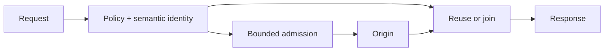

# Bounded Origin

Bounded Origin is a Java 21 library and HTTP gateway that limits how much expensive
origin computation incoming requests can cause. You define which requests mean
the same work, how much new work may run, and which results can be reused.

[Try it](#try-it) · [Configuration](CONFIGURATION.md) · [Benchmarks](BENCHMARKS.md)

## Why it exists

Serving a result can be cheap while producing it is expensive. Many URLs may name
the same underlying operation; a stream of distinct requests may keep creating
new work. Counting requests alone tells you neither how much computation they
cause nor how much of it is redundant.

Bounded Origin puts the budget on that work. Equivalent requests can share one
running computation. Distinct operations compete for explicitly limited capacity.
Completed, reusable results can be served without computing them again.

The guiding invariant is: **untrusted demand must not control the rate of expensive
origin computation.** The implemented bound is on outstanding operations. It does
not impose a fixed operations-per-second rate or cap total CPU consumption.

The project was inspired by scraper-triggered rendering described in
[Creepy crawlies](https://people.kernel.org/monsieuricon/creepy-crawlies).
That article explains the motivating problem; it does not evaluate or endorse
Bounded Origin.

## How it works

For each request, a policy decides whether work is allowed and identifies the
operation from its meaningful inputs. The gateway then reuses an eligible artifact,
joins an equivalent running computation, or admits a new producer within both
global and policy budgets. Full queues return **503 with `Retry-After`**; unmatched
requests are denied.



Equivalence is explicit. A route can select path captures and query parameters,
normalize supported encoded aliases, and discard irrelevant query noise. The
producer receives those selected inputs; ignored caller inputs cannot silently
change a shared result. Method, host, body digest and selected representation
headers also participate in HTTP identity.

The computation budget outlives the connection. **A timeout does not prove that
the origin stopped working.** The gateway records ownership durably before
dispatch and retains uncertain work against capacity, including after restart.
That avoids admitting replacement work while an earlier computation may still
be running.

## What has been measured

The [reproducible campaign](BENCHMARKS.md) used a deterministic synthetic CPU
workload, the packaged gateway, and independent origin-side work counts. It ran
on Java 21 in a shared WSL2 Linux environment. The direct comparison uses the same
origin, inputs and cost without the gateway or artifact reuse.

<!-- generated-readme-results:start -->
For 256 requests naming one operation at concurrency 64, across 10 measured repetitions,
both gateway strategies used active capacity 1 and queue capacity 0:

| Path | Origin executions, mean [min, max] | Maximum actual origin concurrency |
|---|---:|---:|
| Direct origin | 256 [256, 256] | 45 |
| `BOUNDED_COMPUTE` | 10 [9, 13] | 1 |
| `MATERIALIZE` | 1 [1, 1] | 1 |

There is a latency cost. In the separate sequential-request comparison,
the median of per-trial p99 latencies was **81.5 ms** through `BOUNDED_COMPUTE`
versus **20.4 ms** directly. These are measurements of the complete paths,
not an attribution of overhead to any one component.

<!-- generated-readme-results:end -->

Warm and restarted materialization required no origin recomputation in the tested
workload. Distinct-key pressure stayed within configured origin capacity while
rejecting excess work. Single-flight applies to overlapping requests; successive
`BOUNDED_COMPUTE` requests can start successive executions.

Route matching and semantic-key costs grew with configuration complexity. At high
offered load, the finite client also dropped requests before sending them. These
results support the mechanism within the measured conditions; they do not establish
performance for an application workload. Full distributions, failures, raw data,
environment details and reproduction commands are in [BENCHMARKS.md](BENCHMARKS.md).

## Try it

Download the **0.1.0 CLI distribution** from
[Releases](https://github.com/aalsanie/bounded-origin/releases):
`bounded-origin-0.1.0.tar` for POSIX or `bounded-origin-0.1.0.zip` for Windows.
The distribution includes its dependencies and requires Java 21.

For this local demonstration, also install Python 3 and save
[materialize.yaml](examples/materialize.yaml) and
[public_origin.py](examples/public_origin.py) beside the downloaded archive.
The configuration materializes public responses from a small loopback origin;
the gateway itself needs no application code.

First, start the demonstration origin in its own terminal:

```sh
python public_origin.py
```

In a second terminal, extract the distribution, validate the configuration and
start the gateway:

<details>
<summary>POSIX</summary>

```sh
tar -xf bounded-origin-0.1.0.tar
./bounded-origin-0.1.0/bin/bounded-origin validate --config materialize.yaml
./bounded-origin-0.1.0/bin/bounded-origin run --config materialize.yaml
```

</details>

<details>
<summary>Windows PowerShell</summary>

```powershell
Expand-Archive .\bounded-origin-0.1.0.zip -DestinationPath .
.\bounded-origin-0.1.0\bin\bounded-origin.bat validate --config materialize.yaml
.\bounded-origin-0.1.0\bin\bounded-origin.bat run --config materialize.yaml
```

</details>

`validate` exits silently with code 0 on success. In another terminal, send two
equivalent requests; on PowerShell use `curl.exe`:

```sh
curl "http://127.0.0.1:8080/hello/world?noise=one"
curl "http://127.0.0.1:8080/hello/%77orld?noise=two"
```

Both return `Hello from /hello/world.` The configured path normalization and query
selection make them the same operation: the first request materializes the result,
and the second reuses it. Restart the gateway from the same working directory and
request it again to reuse the persisted artifact. The origin log shows which
requests actually reached it.

The example keeps state in `bounded-origin-data/` and binds its listeners to
loopback. Its admin endpoint exposes [metrics](http://127.0.0.1:8081/metrics),
health and readiness. This is a wiring demonstration, separate from the benchmark
workload. Configuration changes take effect on restart.

## Before connecting an origin

The HTTP gateway is for **public results that can be shared safely**. Persisted
results must remain valid for their versioned identity. Caller-specific,
authenticated, conditional and range responses are outside this sharing model.
The origin must explicitly affirm public sharing; see the
[representation contract](CONFIGURATION.md#public-representation-contract).

The computation guarantee also requires that **all work caused by an operation,
including delegated work, finishes before its complete response**. All work being
bounded must pass through the same gateway ownership state. Preserve that state
across restarts, keep its directory exclusive, and use a filesystem with reliable
locking and atomic moves. A fresh ownership directory requires that no old work
is still running. Independent gateways with separate state do not share one budget.

Unknown termination can consume capacity indefinitely. Restarting or deleting
ownership files cannot establish that old work has stopped. Read the
[ownership and recovery contract](CONFIGURATION.md#computation-ownership) before
deployment. Neither configuration validation nor a closed socket can verify an
arbitrary origin's behavior.

Bounded Origin complements authentication, TLS termination, ingress rate limits
and CDN/WAF controls. It does not identify bots, eliminate incoming traffic or
make arbitrary remote computation safe to cancel.

## Choose a policy

| Strategy | Behavior |
|---|---|
| `DENY` | Reject without origin computation. |
| `ARTIFACT_ONLY` | Serve a stored artifact; return 404 on a miss. |
| `BOUNDED_COMPUTE` | Share overlapping computation within budgets; do not persist new results. |
| `MATERIALIZE` | Reuse a stored artifact, or compute within budgets and publish the result. |
| `CLIENT_COMPUTE` | Return a JSON computation description for an application-supplied client implementation. |

Artifact reuse requires `PUBLIC_IMMUTABLE`; this also allows `BOUNDED_COMPUTE` to
reuse an existing artifact. `PUBLIC` permits sharing a running computation without
persistent reuse. The [configuration reference](CONFIGURATION.md) covers these
contracts, every field, defaults, limits and operational metrics.

Java integrations can use the [public API](bounded-origin-api/src/main/java/io/github/aalsanie/boundedorigin/api)
and [execution core](bounded-origin-core/src/main/java/io/github/aalsanie/boundedorigin/core)
directly. Embedded producers must honor their computation-lifetime contracts and
close owned result handles.

## Development and license

[CI](.github/workflows/ci.yml) exercises Ubuntu and Windows, including packaged
process tests, coverage and mutation gates, static analysis, dependency verification,
reproducible archives and Docker smoke. Correctness tests cover concurrency,
timeouts, disconnects, restart, representation boundaries and storage failures.
Performance measurements run separately from ordinary correctness gates.

```sh
./gradlew clean check --init-script .github/spotbugs-reports.init.gradle --stacktrace
```

Windows uses `gradlew.bat`. [Report issues](https://github.com/aalsanie/bounded-origin/issues)
with a reproducer and the version/configuration involved.

To build a CLI distribution from source, run `./gradlew :bounded-origin-cli:distTar`
or `gradlew.bat :bounded-origin-cli:distZip`; archives are written to
`bounded-origin-cli/build/distributions/`.

The runtime is **AGPL-3.0-only**; `bounded-origin-api` is **Apache-2.0**.
See [Licensing](LICENSING.md) for component and third-party terms.
