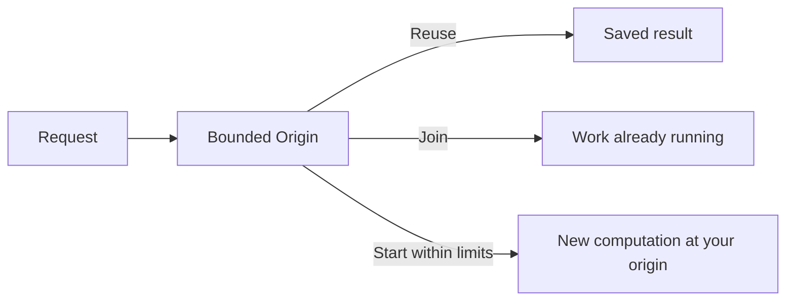

# Bounded Origin

[](https://github.com/aalsanie/bounded-origin/actions/workflows/ci.yml)
[](https://central.sonatype.com/artifact/io.github.aalsanie/bounded-origin-core)
[](build.gradle.kts)
[](LICENSING.md)

Bounded Origin is an **HTTP gateway and Java library for controlling expensive
server-side work**. Equivalent requests can share one computation, new work runs
within explicit limits, and saved results can be reused across restarts.



Serving a result can be cheap while producing it is expensive. Request counts alone
do not capture that cost: many URLs may ask for the same work, while distinct
requests can continuously create new work. The scraper-triggered rendering in
[Creepy crawlies](https://people.kernel.org/monsieuricon/creepy-crawlies) motivated
this repository.

You configure which inputs identify the same operation and set global and
per-policy limits on active and queued work. Excess requests receive **503 with
`Retry-After`**; unclassified requests are denied. The [configuration guide](CONFIGURATION.md)
covers routing, budgets and the five policy strategies.

## Applied to Git/cgit

[Bounded Origin Git](https://github.com/aalsanie/bounded-origin-git) is an independent
application built on the released **Bounded Origin 0.1.0** libraries. Trusted
preparation renders pages; anonymous reads serve stored results; supported Git
comparisons run on the client.

In its [Linux/cgit campaign](https://github.com/aalsanie/bounded-origin-git/blob/a8ca9fd93a3a562073f800a8f1a7c289898136eb/BENCHMARKS.md),
across **47,200 measured Bounded Origin attempts**, anonymous requests caused
**zero native cgit executions**. For the **512-page unique crawl**, prepared BO
delivered **512/512 representations in every one of ten measured repetitions**,
again with zero request-triggered cgit.

[](https://github.com/aalsanie/bounded-origin-git/blob/a8ca9fd93a3a562073f800a8f1a7c289898136eb/README.md#what-the-campaign-establishes)

Preparation required **512 trusted renders**; unprepared pages return 404.
Client-side comparisons have a separate cost and coverage tradeoff:

[](https://github.com/aalsanie/bounded-origin-git/blob/a8ca9fd93a3a562073f800a8f1a7c289898136eb/BENCHMARKS.md#comparison-coverage)

[Full results, preparation costs and reproduction instructions](https://github.com/aalsanie/bounded-origin-git/blob/a8ca9fd93a3a562073f800a8f1a7c289898136eb/BENCHMARKS.md).

## Usage

### Quick start

The gateway runs from YAML and requires **Java 21**. Download the
[0.1.0 distribution](https://github.com/aalsanie/bounded-origin/releases/tag/v0.1.0):
`bounded-origin-0.1.0.tar` for POSIX or `bounded-origin-0.1.0.zip` for Windows.
Dependencies are included.

Save [materialize.yaml](examples/materialize.yaml) and
[public_origin.py](examples/public_origin.py) beside the archive. Start the demo
origin in one terminal (Python 3 required):

```sh
python public_origin.py
```

In a second terminal, extract, validate and run:

```sh
tar -xf bounded-origin-0.1.0.tar
./bounded-origin-0.1.0/bin/bounded-origin validate --config materialize.yaml
./bounded-origin-0.1.0/bin/bounded-origin run --config materialize.yaml
```

<details>
<summary>Windows PowerShell commands</summary>

```powershell
Expand-Archive .\bounded-origin-0.1.0.zip -DestinationPath .
.\bounded-origin-0.1.0\bin\bounded-origin.bat validate --config materialize.yaml
.\bounded-origin-0.1.0\bin\bounded-origin.bat run --config materialize.yaml
```

</details>

In another terminal, send two equivalent requests (use `curl.exe` on PowerShell):

```sh
curl "http://127.0.0.1:8080/hello/world?noise=one"
curl "http://127.0.0.1:8080/hello/%77orld?noise=two"
```

Both return `Hello from /hello/world.` The first saves the result; the second
reuses it. Restart from the same working directory to reuse it again. State lives
in `bounded-origin-data/`; listeners bind to loopback.

Next: [adapt the configuration](CONFIGURATION.md#adapt-the-example) and
[inspect metrics, health and readiness](CONFIGURATION.md#observability).

### Use from Java

Add the core engine from Maven Central:

```kotlin
dependencies {
    implementation("io.github.aalsanie:bounded-origin-core:0.1.0")
}
```

<details>
<summary>Maven equivalent and other modules</summary>

```xml
<dependency>
    <groupId>io.github.aalsanie</groupId>
    <artifactId>bounded-origin-core</artifactId>
    <version>0.1.0</version>
</dependency>
```

| Module | Purpose |
|---|---|
| `bounded-origin-api` | Framework-independent public contracts. |
| `bounded-origin-core` | Policy and execution engine; includes the API. |
| `bounded-origin-store-fs` | Filesystem artifact storage. |
| `bounded-origin-proxy` | Embeddable HTTP gateway; includes the core and API. |

</details>

## Mechanism benchmarks

The [generic benchmark campaign](BENCHMARKS.md) compares a synthetic CPU origin
with shared computation (`BOUNDED_COMPUTE`) and saved results (`MATERIALIZE`). It
uses the packaged gateway, independent origin-side work counts and the same
origin workload, on Java 21 in a shared WSL2 environment.

<!-- generated-readme-results:start -->
For 256 requests naming one operation at concurrency 64, across 10 measured repetitions,
both gateway strategies used active capacity 1 and queue capacity 0:

| Path | Origin executions, mean [min, max] | Maximum actual origin concurrency |
|---|---:|---:|
| Direct origin | 256 [256, 256] | 45 |
| `BOUNDED_COMPUTE` | 10 [9, 13] | 1 |
| `MATERIALIZE` | 1 [1, 1] | 1 |

There is a latency cost. In the separate sequential-request comparison,
the median of per-trial p99 latencies was **81.5 ms** through `BOUNDED_COMPUTE`
versus **20.4 ms** directly.

<!-- generated-readme-results:end -->

Routing and operation-key costs grow with configuration complexity. Full results,
charts, raw evidence and reproduction commands are in [Benchmarks](BENCHMARKS.md).

## Before deploying

**Responses must be safe to share.** The HTTP gateway serves public results;
stored results must remain valid for their versioned identity. Caller-specific,
authenticated, conditional and range responses are outside this model. The origin
must affirm public sharing; see the [response contract](CONFIGURATION.md#public-representation-contract).

**A timeout does not prove computation stopped.** The origin must finish all work,
including delegated work, before its complete response. Uncertain work retains
capacity indefinitely, including across restarts. Preserve the exclusive ownership
state and route all work being bounded through that domain. Read the
[ownership and recovery requirements](CONFIGURATION.md#computation-ownership)
before deployment.

Bounded Origin complements authentication, TLS termination, rate limits and CDN/WAF
controls. It does not identify bots or stop incoming traffic.

## License

The runtime is **AGPL-3.0-only**; `bounded-origin-api` is **Apache-2.0**.
See [Licensing](LICENSING.md) for terms and [Security](SECURITY.md) to report a vulnerability.
