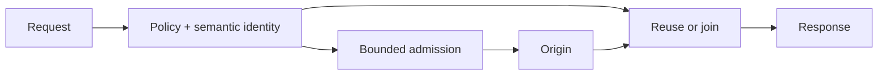
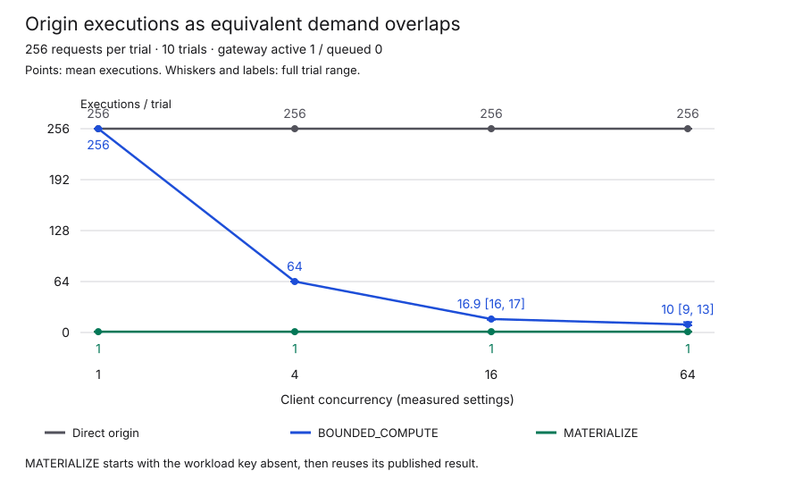
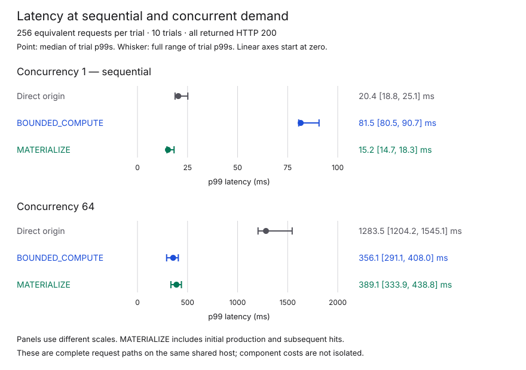

# Bounded Origin

[](https://github.com/aalsanie/bounded-origin/actions/workflows/ci.yml)
[](https://central.sonatype.com/artifact/io.github.aalsanie/bounded-origin-core)
[](build.gradle.kts)
[](build.gradle.kts)
[](LICENSING.md)

Bounded Origin is a Java 21 library and HTTP gateway that limits how much expensive
origin computation incoming requests can cause. You define which requests mean
the same work, how much new work may run, and which results can be reused.



## Why it exists

Serving a result can be cheap while producing it is expensive. Many URLs may name
the same underlying operation, and a stream of distinct requests may keep creating
new work. Counting requests alone tells you neither how much computation they cause
nor how much of it is redundant.

Bounded Origin puts the budget on that work. Equivalent requests can share one
running computation, distinct operations compete for explicitly limited capacity,
and completed reusable results can be served without computing them again.

The scraper-triggered rendering described in
[Creepy crawlies](https://people.kernel.org/monsieuricon/creepy-crawlies)
motivated this repository's approach to controlling origin work.

Routes decide which requests count as the same work. Global and per-policy
limits control how much new origin work can start. When capacity is full, excess
requests get **503 with `Retry-After`**. If the gateway cannot prove that origin
work has finished, that work keeps consuming capacity across timeouts and restarts.

## What has been measured

The [reproducible campaign](BENCHMARKS.md) used a deterministic synthetic CPU
workload, the packaged gateway, and independent origin-side work counts. It ran
on Java 21 in a shared WSL2 Linux environment. The direct comparison uses the same
origin, inputs and cost without the gateway or artifact reuse.



<!-- generated-readme-results:start -->
For 256 requests naming one operation at concurrency 64, across 10 measured repetitions,
both gateway strategies used active capacity 1 and queue capacity 0:

| Path | Origin executions, mean [min, max] | Maximum actual origin concurrency |
|---|---:|---:|
| Direct origin | 256 [256, 256] | 45 |
| `BOUNDED_COMPUTE` | 10 [9, 13] | 1 |
| `MATERIALIZE` | 1 [1, 1] | 1 |

There is a latency cost. In the separate sequential-request comparison,
the median of per-trial p99 latencies was **81.5 ms** through `BOUNDED_COMPUTE`
versus **20.4 ms** directly.

<!-- generated-readme-results:end -->



Warm and restarted materialization required no origin recomputation. Distinct-key
pressure stayed within capacity while rejecting excess work. Route matching and
semantic-key costs grew with configuration complexity.

See [Benchmarks](BENCHMARKS.md) for complete results, limitations and reproduction
commands, including overload runs with unsent client drops.

## Usage

### Java library

The published modules are available from Maven Central. Start with the core engine:

```kotlin
dependencies {
    implementation("io.github.aalsanie:bounded-origin-core:0.1.0")
}
```

| Module | Use it for |
|---|---|
| `bounded-origin-api` | Framework-independent public contracts only. |
| `bounded-origin-core` | Policy and execution engine; includes `bounded-origin-api`. |
| `bounded-origin-store-fs` | Filesystem-backed artifact storage; add it alongside the engine or proxy when needed. |
| `bounded-origin-proxy` | Embeddable HTTP gateway runtime; includes `bounded-origin-core` and the API. |

<details>
<summary>Maven equivalent</summary>

```xml
<dependency>
    <groupId>io.github.aalsanie</groupId>
    <artifactId>bounded-origin-core</artifactId>
    <version>0.1.0</version>
</dependency>
```

</details>

Use the module that matches your integration surface rather than depending on all
four. The [configuration reference](CONFIGURATION.md) covers the runtime model,
defaults, limits and operational metrics.

### CLI gateway

Download the **0.1.0 CLI distribution** from
[Releases](https://github.com/aalsanie/bounded-origin/releases):
`bounded-origin-0.1.0.tar` for POSIX or `bounded-origin-0.1.0.zip` for Windows.
The distribution includes its dependencies and requires Java 21.

<details>
<summary>Run the local materialization demo</summary>

Install Python 3 and save [materialize.yaml](examples/materialize.yaml) and
[public_origin.py](examples/public_origin.py) beside the downloaded archive.

Start the demonstration origin:

```sh
python public_origin.py
```

Then extract the distribution, validate the configuration and start the gateway.

#### POSIX

```sh
tar -xf bounded-origin-0.1.0.tar
./bounded-origin-0.1.0/bin/bounded-origin validate --config materialize.yaml
./bounded-origin-0.1.0/bin/bounded-origin run --config materialize.yaml
```

#### Windows PowerShell

```powershell
Expand-Archive .\bounded-origin-0.1.0.zip -DestinationPath .
.\bounded-origin-0.1.0\bin\bounded-origin.bat validate --config materialize.yaml
.\bounded-origin-0.1.0\bin\bounded-origin.bat run --config materialize.yaml
```

`validate` exits silently with code 0 on success. In another terminal, send two
equivalent requests; on PowerShell use `curl.exe`:

```sh
curl "http://127.0.0.1:8080/hello/world?noise=one"
curl "http://127.0.0.1:8080/hello/%77orld?noise=two"
```

Both return `Hello from /hello/world.` The configured path normalization and query
selection make them the same operation: the first request materializes the result,
and the second reuses it. Restart the gateway from the same working directory and
request it again to reuse the persisted artifact.

The example keeps state in `bounded-origin-data/` and binds its listeners to
loopback. Its admin endpoint exposes
[metrics](http://127.0.0.1:8081/metrics), health and readiness.

</details>

## Before connecting an origin

The HTTP gateway is for **public results that can be shared safely**. Persisted
results must remain valid for their versioned identity. Caller-specific,
authenticated, conditional and range responses are outside this sharing model.
The origin must explicitly affirm public sharing; see the
[representation contract](CONFIGURATION.md#public-representation-contract).

The origin must guarantee that **all work caused by an operation, including
delegated work, finishes before its complete response**. The gateway preserves
uncertain work against its budget indefinitely. Deployments must preserve exclusive
ownership state across restarts and route all bounded work through that domain.
Read the [ownership and recovery contract](CONFIGURATION.md#computation-ownership)
before deployment, including its filesystem and recovery requirements.

Bounded Origin complements authentication, TLS termination, ingress rate limits
and CDN/WAF controls. It does not identify bots, eliminate incoming traffic or
make arbitrary remote computation safe to cancel.

## Choose a policy

| Strategy | Behavior |
|---|---|
| `DENY` | Reject without origin computation. |
| `ARTIFACT_ONLY` | Serve a stored artifact; return 404 on a miss. |
| `BOUNDED_COMPUTE` | Share overlapping computation within budgets; do not persist new results. |
| `MATERIALIZE` | Reuse a stored artifact, or compute within budgets and publish the result. |
| `CLIENT_COMPUTE` | Return a JSON computation description for an application-supplied client implementation. |

Artifact reuse requires `PUBLIC_IMMUTABLE`; this also allows `BOUNDED_COMPUTE` to
reuse an existing artifact. `PUBLIC` permits sharing a running computation without
persistent reuse.

## License

The runtime is **AGPL-3.0-only**; `bounded-origin-api` is **Apache-2.0**.
See [Licensing](LICENSING.md) for component and third-party terms.
